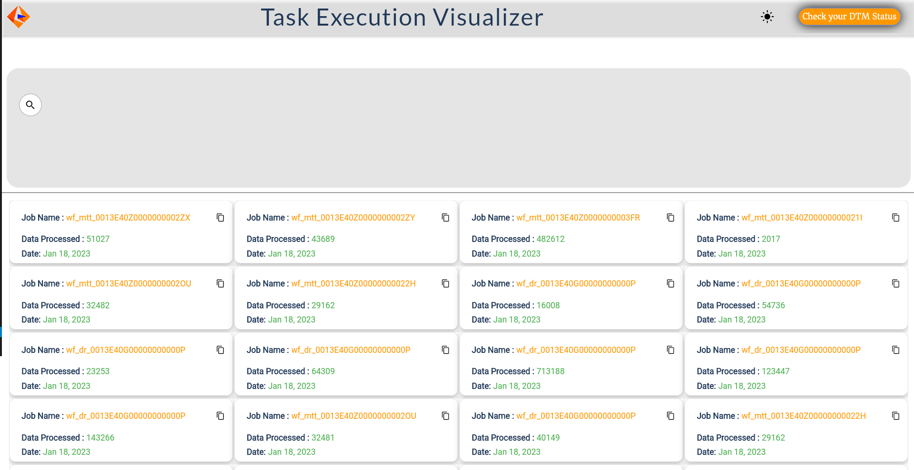
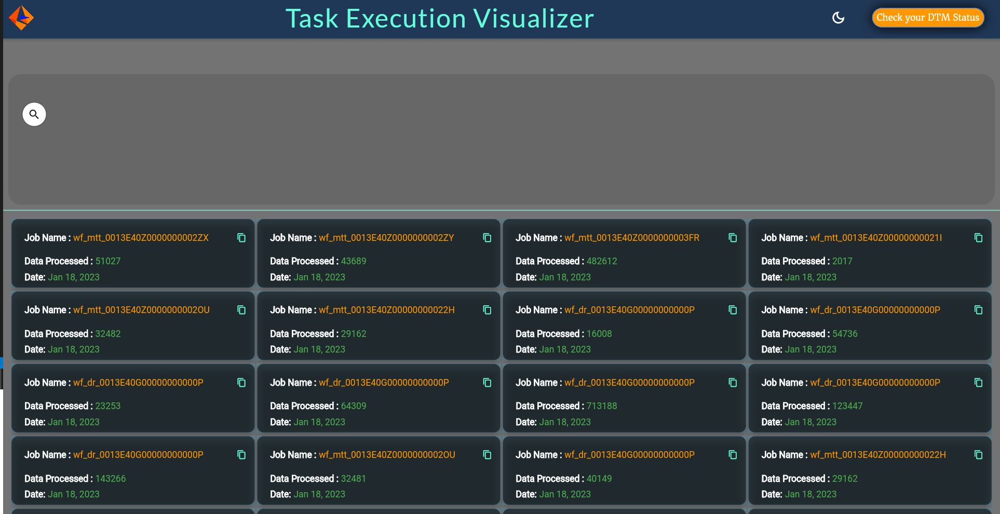
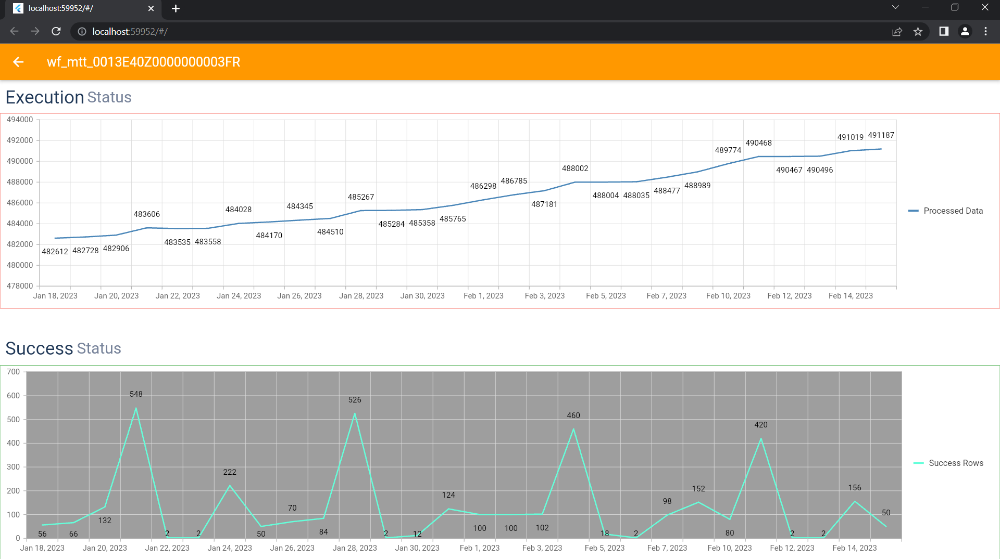
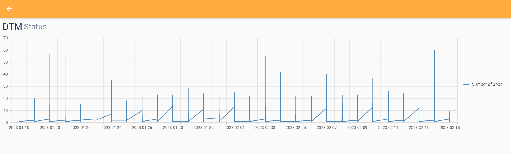

# Task Execution Visualizer

   
   

 
* Star this Repo. if you like the app & support me, this keeps me motivated and keep going for further development

Going with Flutter is a easy choice with its quick development time and fast execution times.

# Tech Stacks

-   
-    
-   

# 🔦 What is it?
- A web app that helps to analyze Tomcat log of a DTM (Data Transformation Manager) process and shows a graph of the number of data processed within Informatica tool is a powerful tool for monitoring and troubleshooting data transformation processes. This web app allows users to easily track the progress of their DTM process and quickly identify any issues that may arise.

With this web app, users can view and analyze the Tomcat log data in real-time to identify any errors, warnings, or other issues that may occur during the DTM process. The app can also display the number of data processed within the Informatica tool, providing users with valuable insights into the performance and efficiency of their data transformation process.

## Screenshots
     

     
  
